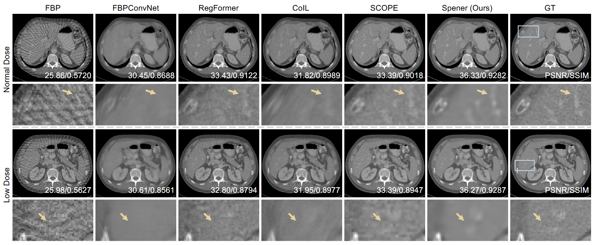

# Spener

This is the official code repository of our work **"Unsupervised Self-prior Embedding Implicit Neural Respresentation for Iterative Sparse-View CT Reconstruction"** accepted by AAAI 2025. [[arXiv]](https://arxiv.org/abs/2502.05445)[[AAAI Proceedings]](https://ojs.aaai.org/index.php/AAAI/article/view/32794)

## Overview

*Fig. 1. Overview of proposed Spener.* 

## Results

*Fig. 2. Qualitative results of CT image reconstructed by the compared methods under two dose settings, with both results reconstructed from AAPM dataset with 90 views.* 

## File Tree
```bash
Spener
│   dataset.py                  # dataloader
│   netarch.py                  # network architecture
│   README.md                   # readme file
│   requirements.txt            # requirements file
│   train.py                    # train file
│   utils.py                    # tools
│
├── config
│       demo_config.json        # demo configuration file
│
├── demo_data
│       demo_AAPM_slice.nii.gz  # demo data 
│
├── Fig
│       pipeline.png     
│       results1.png     
│
└── output
    └── SV_90_I0_1e+06
            final_recon.nii.gz   # Spener reconstruction
            gt_img.nii.gz        # GT image
            sv_fbp.nii.gz        # reconstruction from sparse-view
```


## Main Requirements
To run this project, you will need the following packages:
- PyTorch
- tinycudann
- torch-radon
- bm3d
- SimpleITK
- tqdm
- NumPy 
- other dependencies
  
the repo of torch-radon is at https://github.com/carterbox/torch-radon.


``` bash

conda create -n spener python=3.10
conda activate spener
pip install -r requirements.txt
```
  
## Training and Checkpoints
To train Spener from scratch, navigate to the project directory and run the following command in your terminal:


```bash
python train.py
```

The code will train the Spener to reconstruct a demo slice `./demo_data/demo_AAPM_slice.nii.gz` from the AAPM dataset under the following conditions:
- 90 projection views 
- Normal dose settings ($I_0=10^6$)  

The training config file is `./config/demo_config.json`.  The code will save the corresponding model weights and reconstruction results in each iteration in `./output`. 


## Others

NIFTI files (`.nii`) can be viewed using the ITK-SNAP software, available for free download at: http://www.itksnap.org/pmwiki/pmwiki.php?n=Downloads.SNAP4


## Citation
```
@article{Tian_Chen_Wu_Du_Shi_Wei_Zhang_2025, 
title={Unsupervised Self-Prior Embedding Neural Representation for Iterative Sparse-View CT Reconstruction}, 
volume={39}, 
url={https://ojs.aaai.org/index.php/AAAI/article/view/32794}, 
DOI={10.1609/aaai.v39i7.32794}, 
number={7}, 
journal={Proceedings of the AAAI Conference on Artificial Intelligence}, 
author={Tian, Xuanyu and Chen, Lixuan and Wu, Qing and Du, Chenhe and Shi, Jingjing and Wei, Hongjiang and Zhang, Yuyao}, 
year={2025}, 
month={Apr.}, 
pages={7383-7391} 
}
```

